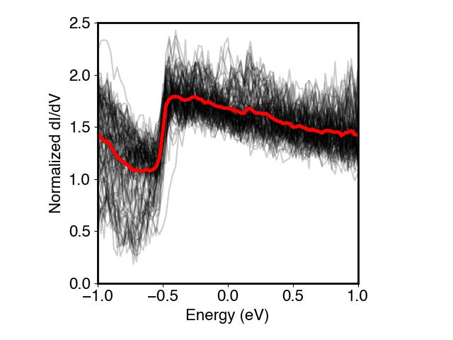
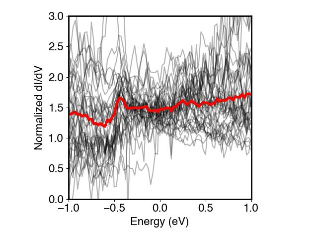
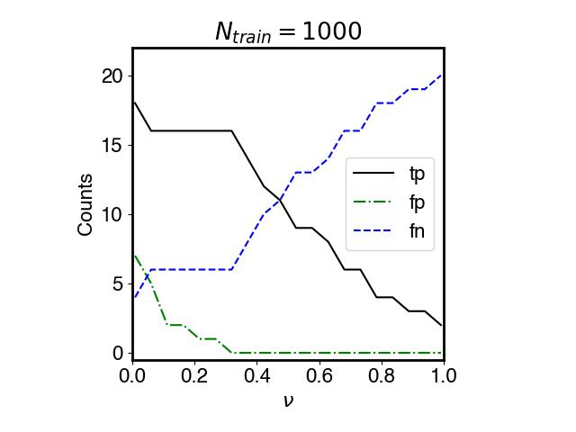
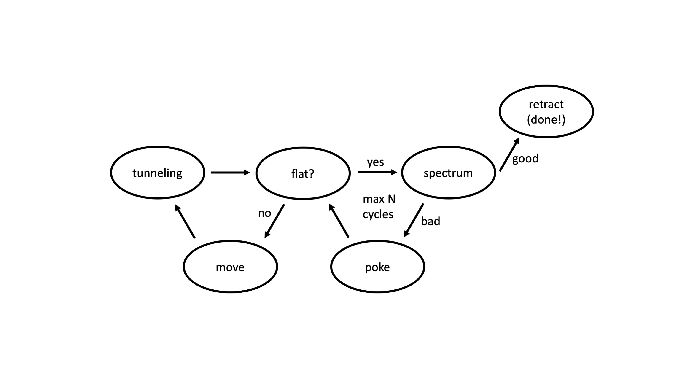

# STMprep

A scanning tunneling microscope (STM) consists of an atomically sharp probe suspended over a flat sample.  A tunneling junction is established and the current is continuously measured and recorded.  The probe can be positioned over the sample with picometer precision using piezoelectric actuators.  An important aspect of STM is controlling the quality of the probe prior to each measurement.  This is typically done be measuring a control sample, typically an elemental metal like gold, and calibrating the state of the probe against this control.  The probe condition can be improved in situ by gently pushing the probe into the control sample to create a clean metallic apex.  We call this "preparing the tip."  

The present code implements an automated tip preparation procedure.  We first manually collect measurements taken with a "good" tip and with a "bad" tip.  Measurements collected with a good tip display the well known spectral properties of a gold (111) surface.  The bad tip measurements, on the other hand, follow no clear pattern.  Here are a collection of measurements with a good tip (the red curve is the average of the light gray curves):

And here is a collection of measurements with a bad tip:

There are a lot of good ways for a tip to be bad!  It is therefore appropriate, in training a classifier to recognize good versus bad tips, to approach the problem as an exercise in novelty detection.  

Since STM measurements are typically tedious and time consuming, we collect only on the order of 100 measurements manually.  We augment this dataset by modellling the good tip measurements as being drawn from a multivariate normal distribution with fitted mean and covariance.  We then draw stochastically from this distriution to create a dataset of 1000 generated measurements.  

A [single class support vector machine](https://citeseerx.ist.psu.edu/viewdoc/download?doi=10.1.1.675.575&rep=rep1&type=pdf) (SVM) classifier is trained on this generated dataset.  In this task incorrectly classifying the tip as good (false positive) is an expensive error that can lead to days of failed measurements.  Incorrectly classifying the tip as bad, on the other hand, will lead to a marginal increase in the time spent preparing the tip.  We therefore seek stringent support vectors that reduce the proportion of false positives to near zero, even as this implies an increase in the false negative rate.  Our optimal classifier (nu = 0.4) achieves a 0% false positive rate, 17% false negative rate, and 20% true positive rate on a test set of size N = 59.  This performance should be continuously reassessed on a growing test set as we continue to use the algorithm and collect more data.

We interface this classifier with custom STM control software contained in the modules stm.py and search.py.  These modules interface with the Nanonis scanning probe microscopy software suite.  The command script is in command.py.  This command script implements the finite state automaton shown in the control flow below.  This virtual machine establishes tunneling on a gold surface and then checks to see if the surface is sufficiently flat to measure.  If the surface is not flat it moves to a new area.  If the surface is flat it checks the tip condition by measuring a spectrum and feeding that measurement to the SVM classifier.  If the spectrum is good, the machine is finished.  If it is not good, then the machine attempts to recondition the tip by pressing it into the gold surface.

We note that this code implements a very basic decision function that considers only the spectroscopic properties of the tip.  Future implementations should also characterize tip morphology by performing classification tasks on two dimensional imaging data using convoloutional networks.
